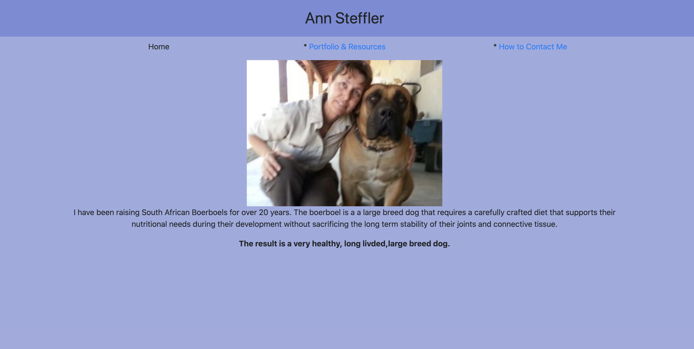
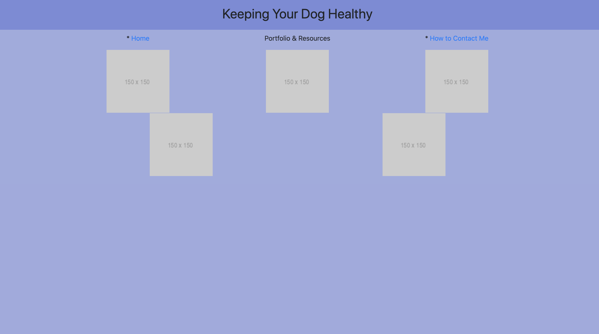
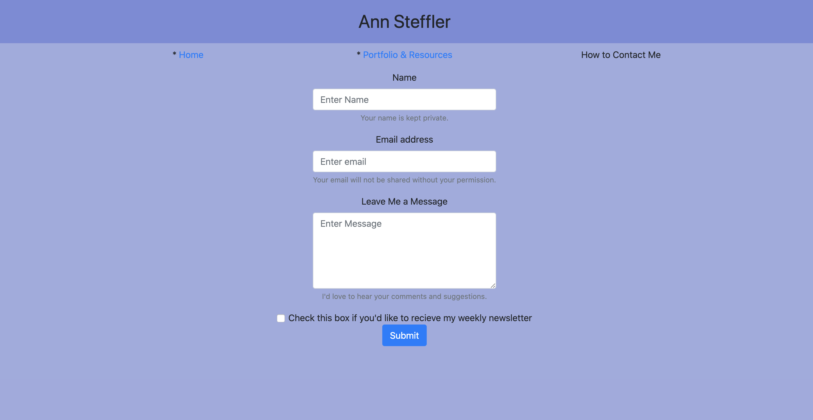

# Bootstrap-02hmwk
The following repository presents my first (clunky) attempt at using Bootstrap's grid system (containers, rows, and columns) to build a set of 3 linked web pages containing a functional navbar and working links between the three pages.

I began this project by creating an index.html, portfolio.html and a contact.html.
Once those were added I began the layout of the index.html with photo and then adjusted the navbar and text placement around that central photo.
I then worked on the links to each page using img src for each page link resulting in the following web pages:

Home page should look like,
  
  
Portfolio page should look like,
  
  
Contact page should look like,
  

Though this a long way from representing good quality web design or even well formatted html coding, I learned a lot from working through this exercise that will hopefully continue to improve my work going forward. 
